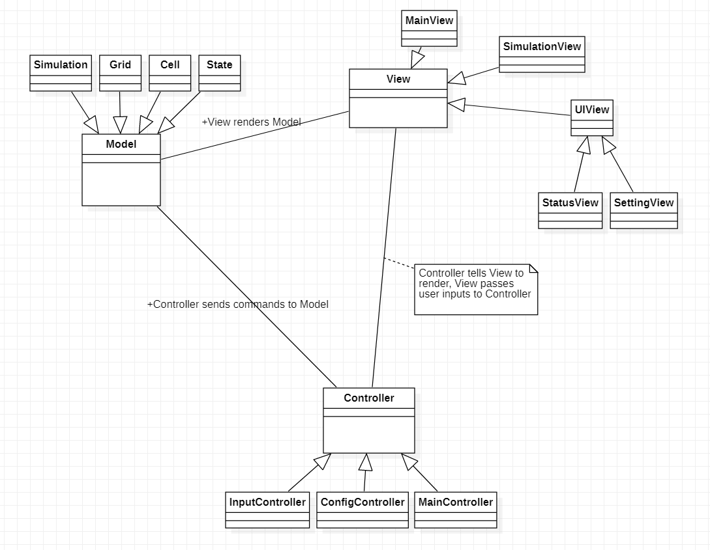
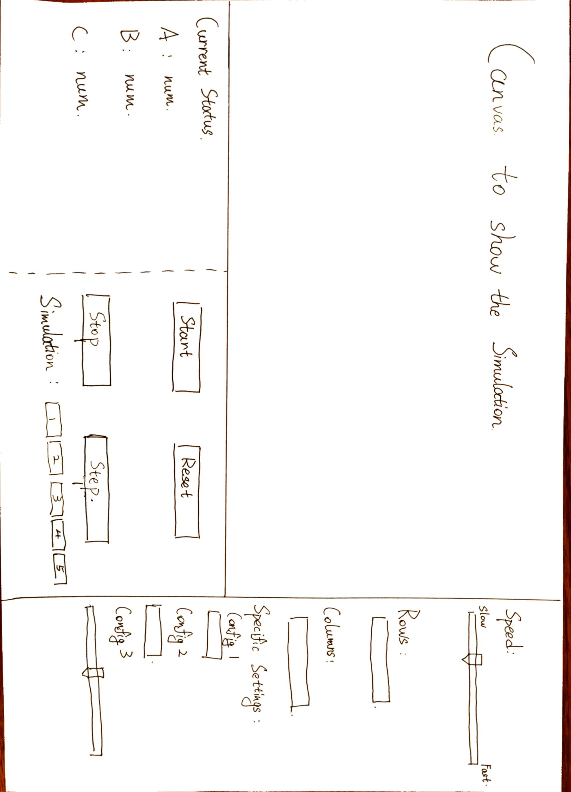

# Cell Society Design Plan

### Team Number

### Names

## Introduction

The project structure is similar to an MVC application, `View` renders `Model` using
javafx, `Controller` handles user inputs (or file inputs), interprets the inputs, and passes
commands to `Model`, `Model` perform actions on its the data according to the received commands.

## Overview

For the models, `Simulation` is responsible for storing, updating the simulation data, and
coordinating `Grid`, `Cell`, and `State`.

For views, `MainView` combines `SimulationView`, `UIView` together and renders the final
visualization seen by users. `MainView` also passes the received user inputs to `InputController`.
`SimulationView` is the visual representation of the cellular simulation. `StatusView`
and `SettingsView` are both `UIView`, the former serves as a display of current simulation status,
while the latter provides interactive UI widgets for users to control game settings.

In terms of controllers, `InputController` handles user input events and passes them
to `MainController`. `ConfigController` is used to read configuration files.
`MainController` apply the configuration to the models at start, update the game according to user
inputs by calling relevant methods of models and telling views to render the models.

## User Interface

With reference
to [Scott Wator World](https://www2.cs.duke.edu/courses/spring21/compsci308/assign/02_simulation/nifty/scott-wator-world/)

The graphical user interface (GUI) will include the things listed below.

* A canvas for displaying the Cell Automata simulation.
* A status board to show the status of the simulation.
* 4 buttons for: step, start, stop, reset the simulation.
* 5 buttons for switching simulation rules.
* Two input boxes for inputting the row and column numbers.
* A bar that can be moved right and left to adjust the speed of the simulation.
* Other buttons needed for the configuring the simulation.

## Configuration File Format

## Design Details

### Simulation

Simulation is an abstract class, we can create its subclasses to implement different game rules.

- `MainController` can call `setStates()` provided by `Simulation` to set states of all cells.
- `MainController` can call `update()` provided by `Simulation` to simulate one step.
- `MainController` can call `setConfig()` provided by `Simulation` to change simulation settings.
- Views get call `getGrid()` provided by `Simulation` to get a 2D list of states representing the
  whole grid, and renders according to the states.

### View

- `MainController` can call `MainView`'s `update()` to render the simulation and UI to screen.
- `MainController` retrieves `SimulationView` and `UIView`'s javafx `Node` object and renders them
  in `update()`.

### Controllers

- `MainController` get the initial configuration by calling `readConfigs()` of `ConfigController`.
- View can call `setInputValue()` provided by `InputController` to pass user inputs to controllers.
- `MainController` retrieves user inputs by calling `getInputValue()` of `InputController`.

## Design Considerations

- We considered how to implement `State` as general as possible. One way of implement is to have a
  map storing all the names and values. Another way is to use inheritance to customize `State` to
  its specific purposes.
    - The first method can reduce the amount of code we write, but it only allows setting the value
      in a same way, or use multiple if statements to set different values.
    - The second method requires more code and makes the inheritance tree very complex, but the
      values can be set in a customized way easily. And the game is easier to extend.
- We also discussed how to pass user inputs to the controller. One way is to receive javafx events
  directly in `InputController`, the other way is to receive the inputs in views and passes them to
  controllers.
    - The first method doesn't require views as the middleman, but the widget values
      in `SettingView` is passed separately.
    - The second method uses views as the middleman, which seems unnecessary, but the all kinds
      input values can be passed using the same API, which makes the code structure clearer.

## Team Responsibilities

* Team Member #1

Andre Wang: Views

* Team Member #2

Tinglong Zhu: Controllers

* Team Member #3

Jiyang Tang: Models
